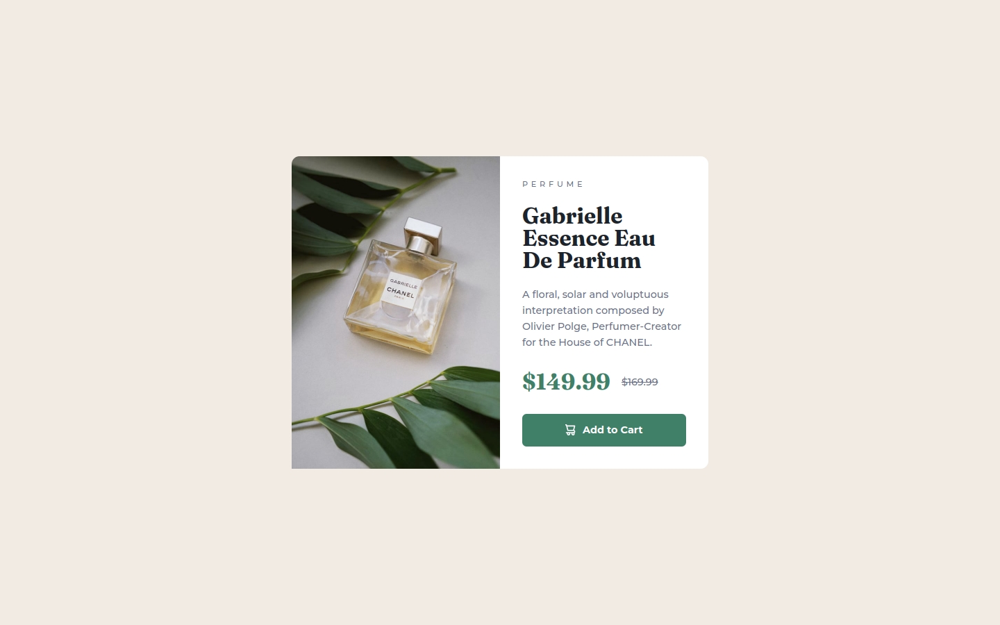
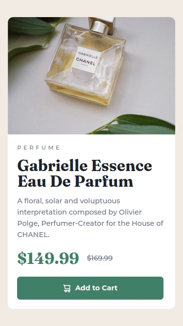

# Frontend Mentor - Product preview card component solution

This is a solution to the [Product preview card component challenge on Frontend Mentor](https://www.frontendmentor.io/challenges/product-preview-card-component-GO7UmttRfa).

## Table of contents

- [Overview](#overview)
  - [The challenge](#the-challenge)
  - [Screenshot](#screenshot)
  - [Links](#links)
- [My process](#my-process)
  - [Built with](#built-with)
  - [What I learned](#what-i-learned)
- [Author](#author)

## Overview

### Screenshot




### Links

- [Solution URL](https://github.com/anderjackie/product-preview-card)
- [Live Site URL](https://htmlpreview.github.io/?https://github.com/anderjackie/product-preview-card/blob/main/index.html)

## My process

### Built with

- Semantic HTML5 markup
- CSS custom properties
- Flexbox

### What I learned

- Use font-weight range for fonts.

```css
@font-face {
  font-family: Montserrat;
  font-weight: 500 700;
  src: url("./assets/fonts/Montserrat.ttf");
}
```

- Pay attention to images and its different sizes in a way of manipulating the maximum and minumum sizes of other components.

```css
.product-image {
  max-width: 300px;
  border-top-left-radius: inherit;
  border-top-right-radius: unset;
  border-bottom-left-radius: inherit;
}

.product {
  max-width: 300px;
}
```

- How to use <picture> and <source> tags with the  tag to render different images based on a condition is a game changer.

```html
<picture>
    <source srcset="./assets/images/image-product-desktop.jpg" media="(min-width: 50rem)">
    
</picture>
```

- Just use a button with an image inside. I was so conditioned to put the icon inside a span. This way is so much better.

```html
<button> Add to Cart</button>
```

### Continued development

Use this section to outline areas that you want to continue focusing on in future projects. These could be concepts you're still not completely comfortable with or techniques you found useful that you want to refine and perfect.

### Useful resources

- [Example resource 1](https://www.example.com) - This helped me for XYZ reason. I really liked this pattern and will use it going forward.
- [Example resource 2](https://www.example.com) - This is an amazing article which helped me finally understand XYZ. I'd recommend it to anyone still learning this concept.

## Author

- Website - [mysmallcornerofinternet](http://mysmallcornerofinternet.life/)
- Frontend Mentor - [@anderjackie](https://www.frontendmentor.io/profile/anderjackie)
